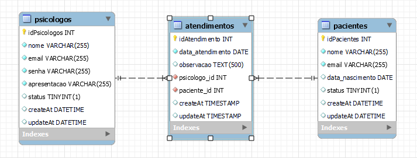

<h1 align=center> La Vie - Saúde Mental </hi>  

## 💻 Sobre o projeto

 
- Desafio #GamaExperience44 HandsOn3

- O projeto pedia para desenvolver uma API que permitisse criar registros de psicólogos, pacientes e prontuários da clínica La Vie.

---

## :mortar_board: Descrição das Funcionalidades

- Banco de Dados:
  Foi feito um banco de dados a partir do MySQL Workbench com três tabelas:

  

   

- Login: 
    - /login (post): Esse endpoint recebe dois parâmetros obrigatórios: email e senha; que são validados de acordo com as informações do banco de dados.
  
   

- Psicólogos:
    - /psicologos (get): Lista todos os psicólogos cadastrados no banco de dados, exibindo todos os atributos da entidade. Caso não exista nenhum psicólogo, envia um array vazio como resposta.
    - /psicologos (post): Recebe um objeto no body da requisição contendo: "nome", "email", "senha", "apresentacao".
    - /psicologos/:id (get): Devolve um objeto com todas as informações do psicólogo do id informado na url, com exceção da senha. 
    - /psicologos/:id (put): Recebe o id do psicólogo que será atualizado. Recebe um objeto no body da requisição contendo: "nome", "email", "senha", "apresentacao".
    - psicologos/:id (del): Irá receber o id do psicólogo que será deletado.
  
   

- Pacientes: 
    - /pacientes (get): Lista todos os pacientes cadastrados no banco de dados, exibindo todos os atributos da entidade. Caso não exista nenhum psicólogo, envia um array vazio como resposta.
    - /pacientes (post): Recebe um objeto no body da requisição contendo: "nome", "email", "idade".
    - /pacientes/:id (get): Devolve um objeto com todas as informações do paciente do id informado na url.
    - /pacientes/:id (put): Recebe o id do psicólogo que será atualizado. Recebe um objeto no body da requisição contendo: "nome", "email", "idade".
    - /pacientes/:id (del): Irá receber o id do paciente que será deletado.
  
   

- Atendimentos:
    - /atendimentos (get): Listado todos os atendimentos realizados por todos os psicólogos cadastrados no banco de dados, exibindo todos os atributos da entidade.
    - /atendimentos (post): Irá receber o id do paciente que será atualizado. Recebe um objeto no body  da requisição contendo: "paciente_id", "data_atendimento", "observação".
    - /atendimentos/:id (get): Devolve um objeto com todas as informações do atendimento do id informado na url.
 
   

---

## :file_folder: Funcionalidades da API

- 

---

:point_down: Clique aqui :point_down:  
 
 <h2> <a href="" >  Documentação da API La Vie</a>  </h2>

[

---

## 🛠 Tecnologias

As seguintes ferramentas foram usadas na construção do projeto:
  

  
  
  
  
  
  
  
  

---

<h2> 👨‍💻 Contribuidores </h2> 

<h2>
<table align=center>
  <tr>

   <td align="center">  <a href="https://www.linkedin.com/in/ellen-ribeiro-borges-7371811bb/"> Ellen Ribeiro </a>
   </td>
   <td align="center">  <a href="https://www.linkedin.com/in/fernando-predes-b1545838/"> Fernando Predes </a>
   </td>
    <td align="center">   <a href="https://www.linkedin.com/in/patricksegalla/"> Patrick Segalla </a>
   </td>
    <td align="center">   <a href="https://www.linkedin.com/in/raphael-anizio-da-silva-0173211b8/"> Thiago Rodrigues </a>
   </td>
   
  </tr>
</table> </h2>

---
